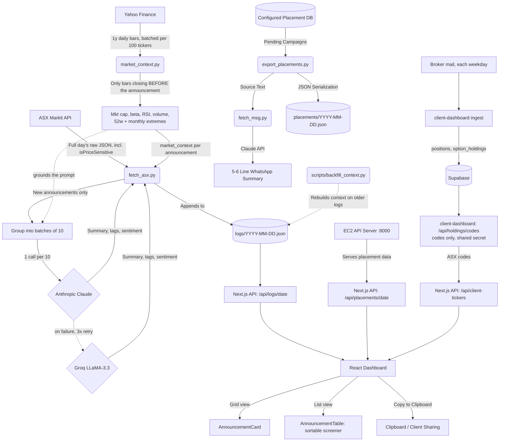

# High-Level Design (HLD)
## Vitti ASX Intelligence Dashboard

### 1. Overview
The Vitti ASX Intelligence Dashboard is an automated pipeline designed to track, summarize, and display announcements from the Australian Securities Exchange (ASX). It captures the full daily feed and surfaces the market-moving subset through the ASX's own price-sensitive flag, rather than filtering the rest away.

### 2. Architecture Goal
The system is built on a **Decoupled Serverless Architecture**. It segregates the heavy lifting (data fetching and AI processing) from the presentation layer (the Next.js User Interface).

### 3. Core Components

#### A. The Data Engine (Python Pipeline)
*   **Source:** Polls the official MarkitDigital ASX JSON API (`asx.api.markitdigital.com/asx-research/1.0/markets/announcements`).
*   **Coverage:** Ingests the **entire trading day**, not only the market-moving subset. `MARKET_SENSITIVE_ONLY` is `False`, so the log mirrors the ASX's own published list.
*   **Market Sensitivity:** Passed straight through from the API's `isPriceSensitive` field. This is the same flag ASX renders as `$` on its Today's Announcements page — verified 27 Aug 2026 at **765/765 agreement** by scraping that page and diffing it against the API. Nothing is inferred or scored on our side.
*   **Processing:** Identifies newly released announcements against the existing log, so repeated runs through the day only enrich the delta.
*   **AI Integration:** Forwards announcements to the **Anthropic Claude API**, with the **Groq API** (LLaMA 3.3) as failover. Announcements are sent in **groups of 10 per call** rather than one call each. The AI reads each headline in the group and outputs, per announcement:
    1.  A 3-bullet-point summary.
    2.  Semantic tags (e.g., "Mining", "Dividend").
    3.  A `bullish` / `bearish` / `neutral` sentiment label.
*   **Price Context (`market_context.py`):** Before the AI stage, one year of daily bars per ticker is pulled from Yahoo Finance in a single batched request and sliced locally. From it the engine derives, per announcement: market capitalisation, beta against the S&P/ASX 200, 14-day RSI, 20-day average volume and the latest session's variance from it, 52-week and 3-month extremes, and the high/low of each of the last three 21-session blocks. Two invariants govern the module: **no look-ahead** (only bars that closed strictly before the announcement enter a context, so a past event and a live one are measured identically) and **facts, not calls** (every field is a measurement the reader can check; the AI is handed these numbers but is never the source of one that renders).
*   **Storage:** The final enriched data is saved directly as a JSON file (`logs/YYYY-MM-DD.json`), with the price context embedded per announcement under `market_context`.
*   **Backfill (`scripts/backfill_context.py`):** Contexts are attached at save time, so a measurement added to the module today is absent from every log written before today. The backfill re-derives them over a date range using the current code, each against its own log date.

#### B. The Presentation Layer (Next.js 14)
*   **Framework:** Built entirely on Next.js App Router with React 18.
*   **Backend-for-Frontend (BFF):** Local API routes (`/api/logs/[date]` and `/api/placements/[date]`) act as bridges, reading local JSON logs or querying external backend APIs and serving them securely to the browser.
*   **Client Interface:** A highly responsive dashboard using Tailwind CSS ("Midnight Intelligence" theme). It features client-side text filtering, layout toggling, theme switching, and a dedicated copy-to-clipboard system for WhatsApp messages.
*   **Clients Ticker (`/api/client-tickers` → client dashboard):** A view over the same day's feed, narrowed to the ASX codes the firm's clients hold. The codes are read from the sibling **client dashboard**, whose morning mail ingest imports broker holdings into Supabase — the reverse of the flow already in place, where that project reads this one's `/api/market-sensitive`. The proxy route holds the shared secret so it never reaches a browser, and returns `ok: false` with a reason rather than an error status, because an empty feed and a broken link are indistinguishable on screen and the second one silently asserts that no client holds anything in the news.
*   **Two Readings of One Feed:** The same filtered, sorted announcement list renders either as cards (**Grid** — what was announced) or as a screener table (**List** — what the company is and where the price sits). The table surfaces the `market_context` measurements as sortable columns; a measurement that could not be taken renders as a dash and sorts to the bottom in both directions, so an absent figure never competes with a real one.

#### C. Placement/IPO Engine & WhatsApp Summary Generator
*   **Source:** Placement and campaign details are served by the external placement backend on AWS EC2.
*   **AI Summary Pipeline (`fetch_msg.py`):** Integrates with the Anthropic Claude API to generate a highly concise 5-6 line summary optimized for mobile readability/sharing on WhatsApp. Also capable of drafting professional client emails.
*   **Export Pipeline (`scripts/export_placements.py`):** Optional local/offline helper that extracts from a configured placement SQLite database path and serializes campaign details into daily JSON files (`placements/YYYY-MM-DD.json`).
*   **EC2 API Integration:** The dashboard pulls live placement and campaign details through Next.js proxy routes referencing an external API server running on AWS EC2 (`http://3.25.70.124:8000`).

### 4. System Flow Diagram

```mermaid
graph TD
    %% ASX Announcements Pipeline
    ASX[ASX Markit API] -->|"Full day's raw JSON, incl. isPriceSensitive"| FA(fetch_asx.py)
    FA -->|New announcements only| GRP[Group into batches of 10]
    GRP -->|1 call per 10| CL{Anthropic Claude}
    CL -.->|on failure, 3x retry| GQ{Groq LLaMA-3.3}
    CL -->|Summary, tags, sentiment| FA
    GQ -->|Summary, tags, sentiment| FA
    YF[Yahoo Finance] -->|"1y daily bars, batched per 100 tickers"| MC(market_context.py)
    MC -->|"Only bars closing BEFORE the announcement"| MEAS["Mkt cap, beta, RSI, volume,<br/>52w + monthly extremes"]
    MEAS -->|market_context per announcement| FA
    MEAS -.->|grounds the prompt| GRP
    FA -->|Appends to| DL[(logs/YYYY-MM-DD.json)]
    BF(scripts/backfill_context.py) -.->|"Rebuilds context on older logs"| DL
    DL --> BFF1[Next.js API: /api/logs/date]

    %% Placement & IPO Pipeline
    DB[(Configured Placement DB)] -->|Pending Campaigns| EP(export_placements.py)
    EP -->|Source Text| FM(fetch_msg.py)
    FM -->|Claude API| WA[5-6 Line WhatsApp Summary]
    EP -->|JSON Serialization| PL[(placements/YYYY-MM-DD.json)]
    EC2[EC2 API Server :8000] -->|Serves placement data| BFF2[Next.js API: /api/placements/date]

    %% Frontend Layer
    BFF1 --> Dashboard[React Dashboard]
    BFF2 --> Dashboard

    %% Client holdings (sibling deployment)
    MAIL[Broker mail, each weekday] --> CD[client-dashboard ingest]
    CD -->|positions, option_holdings| SB[(Supabase)]
    SB --> CDAPI["client-dashboard: /api/holdings/codes<br/>codes only, shared secret"]
    CDAPI -->|ASX codes| BFF3[Next.js API: /api/client-tickers]
    BFF3 --> Dashboard
    Dashboard -->|Grid view| CARDS[AnnouncementCard]
    Dashboard -->|List view| TBL[AnnouncementTable: sortable screener]
    Dashboard -->|Copy to Clipboard| Clip[Clipboard / Client Sharing]
```

### 5. Automation Strategy
*   **Extraction:** A GitHub Actions workflow (`.github/workflows/daily_asx.yml`) runs the Python engine on ASX trading days — every **5 minutes** across the **8:00 – 10:00 AM AEST** opening window, then **hourly until 2:00 PM AEST**. The dense early cadence exists because most market-sensitive announcements are released before and just after the open.
*   **Timezone Handling:** GitHub cron is UTC-only, so the schedule is pinned in UTC while a lightweight `gate` job resolves the real `Australia/Sydney` time at runtime. This keeps behaviour correct across the AEST/AEDT changeover and suppresses weekend runs, without maintaining two parallel sets of cron expressions.
*   **Delivery Reliability:** GitHub provides **no SLA on scheduled workflows**. Measurement over 100 consecutive runs (Jul–Aug 2026) showed it delivering only ~2 of the 12 events requested per hour, with arrival delays of 0–70 minutes, and on 6 Aug 2026 it dropped an entire two-hour block. The schedule is therefore deliberately **over-provisioned**: each cron entry is an independent chance to land a run, not a guaranteed tick. A hard delivery guarantee would require an external scheduler firing `repository_dispatch` instead of relying on GitHub's shared cron.
*   **Idempotency:** Because the fetcher keys on `ticker` + `time` + `headline`, a delayed, duplicated, or catch-up run can never double-write. This is what makes over-provisioning safe.
*   **Incremental Cost:** Each run enriches only what the previous runs have not already logged, so ingesting the whole day does not mean re-processing it. On 27 Aug 2026 the day's 715 in-window announcements arrived as roughly 106 / 205 / 232 / 46 / 54 / 35 / 37 per hourly run — about **75 AI calls across the whole day**, peaking at ~24 in the 10:00 AM run.
*   **Display:** The Next.js dashboard uses a `setInterval` hook to poll the local API route every 5 minutes. As the Python script appends new items to the JSON file, the dashboard automatically updates without requiring a page refresh.
